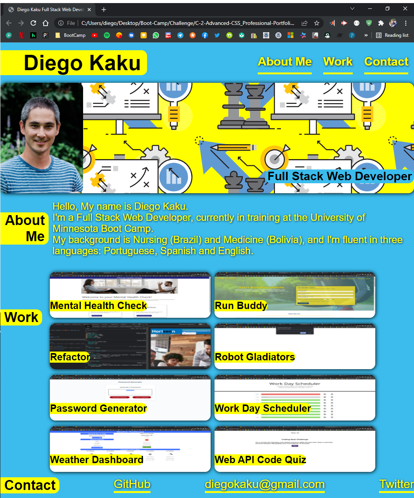

# C-2-Advanced-CSS_Professional-Portfolio

Targeted goals:

- Build a first portfolio without a stater code.
- Basic layout with name, photo, and links to sections about me, projects, and contact.
- Working links.
- Project/Work section with applications photo and link.
- First application presented larger in size than others.
- Present a responsive layout.
- Add Comments to HTML and CSS to help understand the structure and layout.

## Application deployed at URL:

https://github.com/kakudiego/C-2-Advanced-CSS_Professional-Portfolio

## GitHub repository:

https://kakudiego.github.io/C-2-Advanced-CSS_Professional-Portfolio/

## ScreenShots

